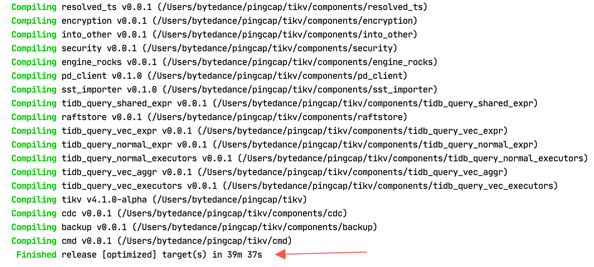

## 明确任务
根据 Homework 的描述，是要部署三个 TiKV，一个TiDB，通过 pd 进行调度，于是通过 Google 搜索 `tikv build`，找到了[这篇文章](1)，根据文中的描述
> Assuming you want to run TiDB, you will need TiDB, Placement Driver (PD), and TiKV. Clone each repo and run make in the root directory of each cloned repo.

嗯，看起来非常 straightforward，于是下面的步骤就围绕着这三大组件的编译和部署展开了。

## PD

首先是 PD，因为根据[build 文档中的 Running 部分](2)说的，需要先运行PD。
1. 通过 `git clone https://github.com/pingcap/pd.git` 下载源码。 

## TiKV

1. 通过 `git clone https://github.com/tikv/tikv.git` 下载源码。
2. 根据上面说的，观察到项目中有 Makefile，于是直接make，经过极其漫长的等待终于完成

3. 根据 [build 文档中的 Running 部分](2)给的例子  
> $TIKV_DIR/target/release/tikv-server --pd-endpoints="127.0.0.1:2379" \
    --addr="127.0.0.1:20160" \
    --status-addr="127.0.0.1:20181" \
    --data-dir=tikv1 \
    --log-file=tikv1.log &
$TIKV_DIR/target/release/tikv-server --pd-endpoints="127.0.0.1:2379" \
    --addr="127.0.0.1:20161" \
    --status-addr="127.0.0.1:20182" \
    --data-dir=tikv2 \
    --log-file=tikv2.log &
$TIKV_DIR/target/release/tikv-server --pd-endpoints="127.0.0.1:2379" \
    --addr="127.0.0.1:20162" \
    --status-addr="127.0.0.1:20183" \
    --data-dir=tikv3 \
    --log-file=tikv3.log &   

尝试直接启动，观察到根目录下多了`tikv1，tikv2和tikv3`三个文件夹以及三个对应的`.log`文件，点开发现
> //TiKV1
[2020/08/16 13:24:55.275 +00:00] [INFO] [raft.rs:894] ["became follower at term 12"] [term=12] [raft_id=49] [region_id=48]
//TiKV2
[2020/08/16 13:24:55.275 +00:00] [INFO] [raft.rs:894] ["became follower at term 12"] [term=12] [raft_id=50] [region_id=48]
//TiKV3
[2020/08/16 13:24:55.276 +00:00] [INFO] [raft.rs:985] ["became leader at term 12"] [term=12] [raft_id=51] [region_id=48]

应该是选主成功了。

## TiDB

根据我的观察，应该把代码写在`tikvStore`中的`Begin`函数中，但是由于时间关系，没部署完...

[1] https://pingcap.com/blog/building-running-and-benchmarking-tikv-and-tidb/   
[2] https://pingcap.com/blog/building-running-and-benchmarking-tikv-and-tidb/#running